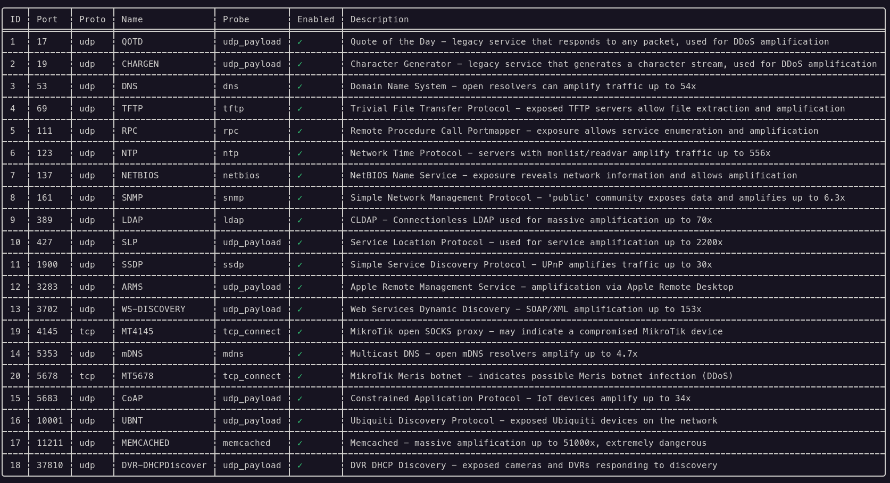
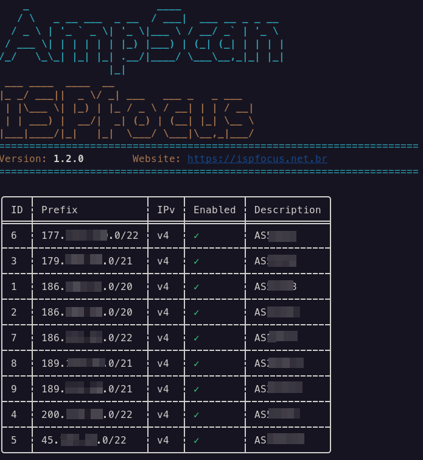
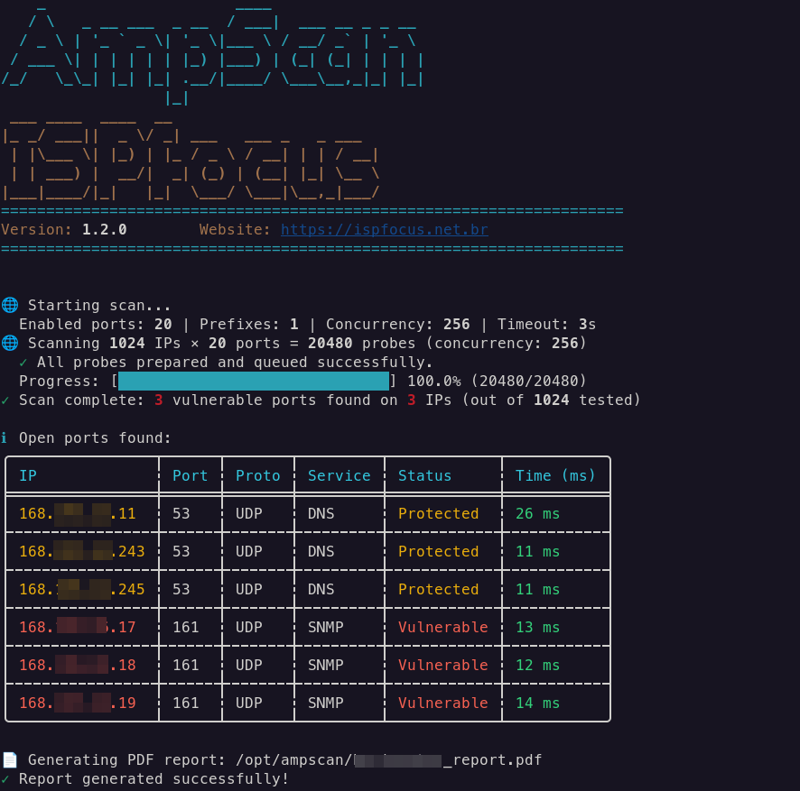

# AmpScan — Usage Manual and User Guide

**AmpScan** is a high-performance command-line (CLI) tool written in Rust, designed to audit networks and identify open and misconfigured ports that could be exploited in **DDoS amplification** attacks across IPv4 and IPv6 protocols.

---

## 🔒 Security First

AmpScan was designed with security at rest in mind. The local SQLite database (`ampscan.db`) is **completely encrypted using SQLCipher (AES-256)**.

### Crucial Environment Variables

Before running any subcommand, you must define the following variables in your environment:

*   `AMPSCAN_DB_KEY`: **[Required]** The secret key used to encrypt/decrypt the database (a long string with more than 32 characters is recommended).
*   `AMPSCAN_DB_PATH`: *(Optional)* Custom path for the database file (default: `ampscan.db`).
*   `AMPSCAN_USER`: *(Optional)* Defines the administrator user to prevent the terminal from interactively prompting for the username on each command.

Environment preparation example:
```bash
export AMPSCAN_DB_KEY="a_very_secure_and_long_secret_key_for_the_db"
export AMPSCAN_USER="admin"
```

---

## 🛠️ Installation and Compilation

To compile the project on your machine (requires the Rust / Cargo toolchain installed):

```bash
# Clone the repository or navigate to the folder
cd ampscan

# Compile in Release mode for maximum scanning performance
cargo build --release
```

The compiled binary will be located at `target/release/ampscan`.

---

## 🧭 Quick Start Workflow

### 1. Initialize the Database
On the first run, initialize the database to create the encrypted schema, register the 20 default ports, and configure the initial administrator user password:

```bash
./target/release/ampscan init
```
*Enter the desired username and set a strong password when prompted interactively.*

### 2. Register a Network Prefix (CIDR)
For full scanning to work, you need to register which network prefixes you own/manage to be tested:

```bash
./target/release/ampscan prefix add --prefix "192.168.1.0/24" --description "Corporate Office Network"
```

### 3. List Registered Ports
Check the amplification ports registered in the system:

```bash
./target/release/ampscan port list
```

### 4. Run a Full Scan
Run the parallel scan on all active prefixes and generate the PDF report:

```bash
./target/release/ampscan scan run --concurrency 512 --output security_report.pdf
```

---

## 📖 CLI Command Reference

### `ampscan init`
Initializes the encrypted database structure, populates it with the 20 default amplification ports, and creates the system's master user.

### Port Management (`port`)
Allows you to manage which ports and payloads will be tested during the scan:

*   **List:**
    ```bash
    ./target/release/ampscan port list
    ```
    
*   **Disable / Enable a specific port:**
    ```bash
    ./target/release/ampscan port disable <ID>
    ./target/release/ampscan port enable <ID>
    ```

### Prefix Management (`prefix`)
Defines the targets for batch scanning (accepts IPv4 and IPv6 ranges):

*   **List:**
    ```bash
    ./target/release/ampscan prefix list
    ```
    
*   **Add:**
    ```bash
    ./target/release/ampscan prefix add --prefix "2001:db8::/120" --description "IPv6 Staging Hosts"
    ```
*   **Disable / Enable:**
    ```bash
    ./target/release/ampscan prefix disable <ID>
    ./target/release/ampscan prefix enable <ID>
    ```

### User Management (`user`)
*   **Add new administrator:**
    ```bash
    ./target/release/ampscan user add --username new_admin
    ```
*   **Change password:**
    ```bash
    ./target/release/ampscan user change-password --username admin
    ```

### Running Scans (`scan`)

AmpScan has two execution modes:

#### 1. Batch Scan Mode (`scan run`)
Fetches all prefixes and ports marked as active (`enabled`) in the database and performs parallel reachability tests.

**Supported parameters:**
*   `--concurrency <N>`: Number of probes sent simultaneously (default: `256`).
*   `--timeout <S>`: Timeout for each probe's response in seconds (default: `3`).
*   `--output <PATH>`: Name of the PDF file to be generated (default: `ampscan_report.pdf`).
*   `--no-icmp`: Disables pre-host ping validation (ICMP). Useful if you are running without `root` privileges or `CAP_NET_RAW` permission on Linux.
    *   *Note:* With `--no-icmp` active, local fallbacks (TCP handshakes) are attempted to check if the host is online, and the "Inconclusive" status will not be returned.
*   `--prefix <CIDR>`: Manual network prefix to scan (e.g.: `192.168.1.0/24`). **Ignores database-configured prefixes and skips PDF report generation**.

Robust execution example:
```bash
./target/release/ampscan scan run --concurrency 500 --timeout 2 --output scan_june.pdf
```


Example with manual prefix:
```bash
./target/release/ampscan scan run --prefix "10.0.0.0/29" --no-icmp
```

#### 2. Single IP Mode (`scan single`)
Tests all active ports against a single destination IP, printing real-time responses and timings to the console:

```bash
./target/release/ampscan scan single 1.1.1.1 --timeout 2 --no-icmp
```

---

## 📈 Understanding the Results

During each port scan, the status can be classified as:

1.  🔴 **Open (Vulnerable):** The target responded to the sent probe. It means the amplification port is open and publicly responds to external requests without filtering.
2.  🟢 **Closed:** The host responded to the ICMP ping or TCP connection, but the amplification service on the indicated port yielded no response.
3.  🔵 **Inconclusive:** The tested host did not respond to the ICMP ping or probe, suggesting the host might be offline or entirely blocking diagnostic traffic.
4.  🟡 **Protected:** The port is open, but it is not vulnerable.
