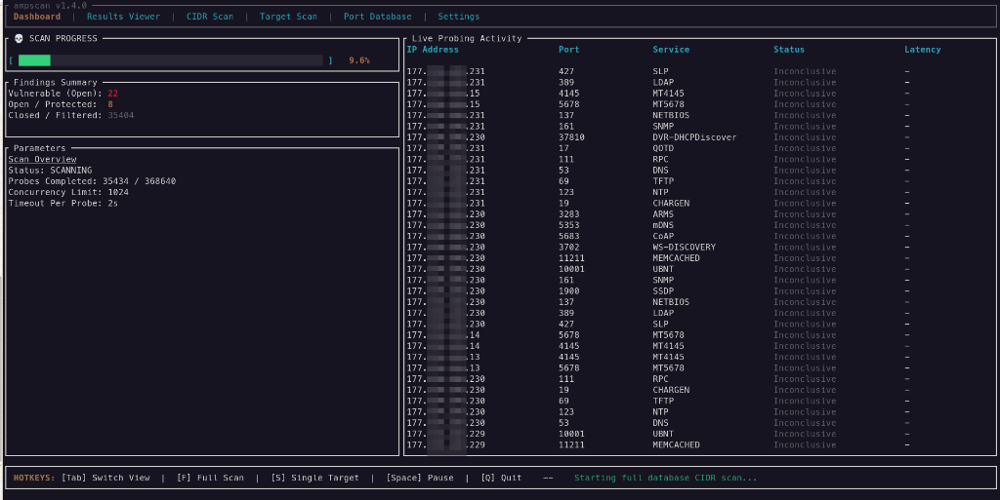
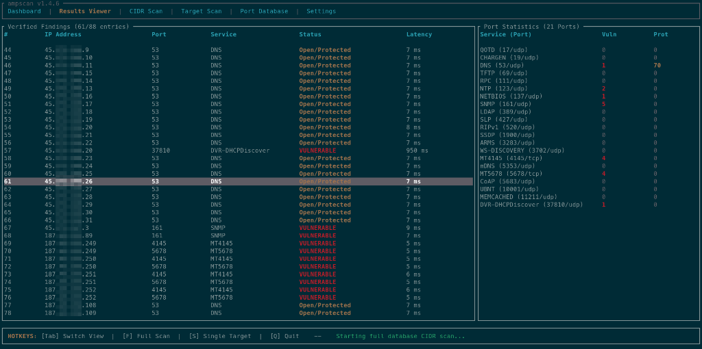
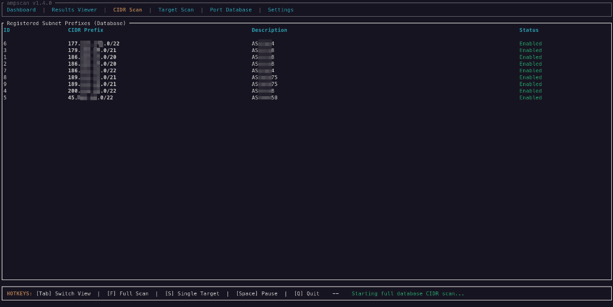
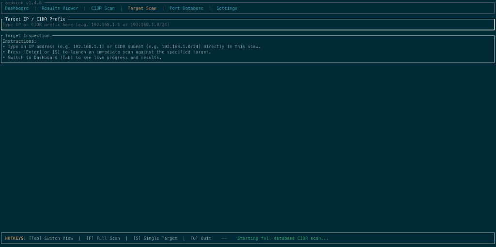
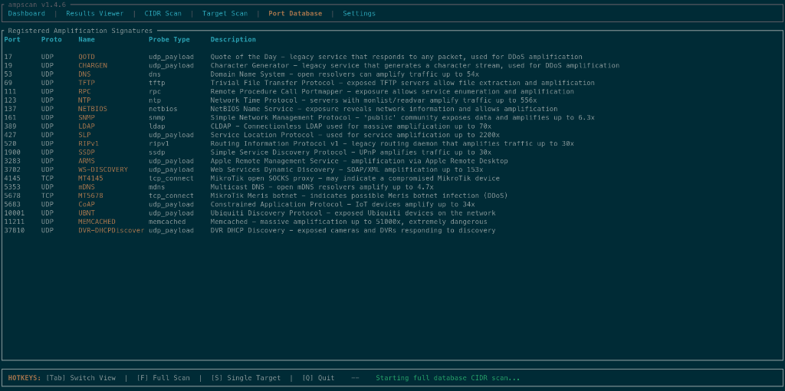
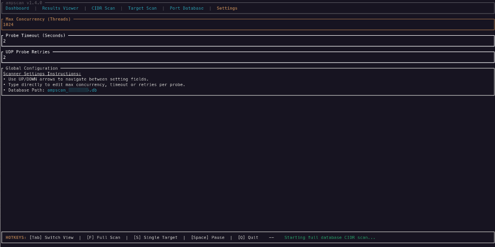
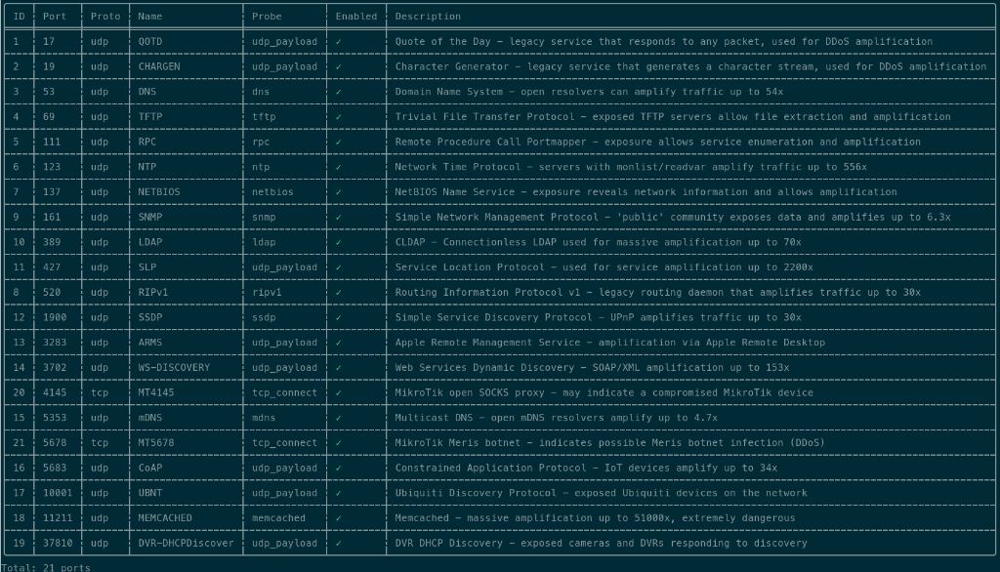
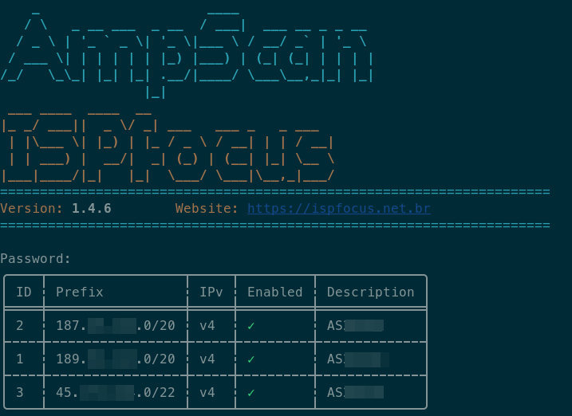
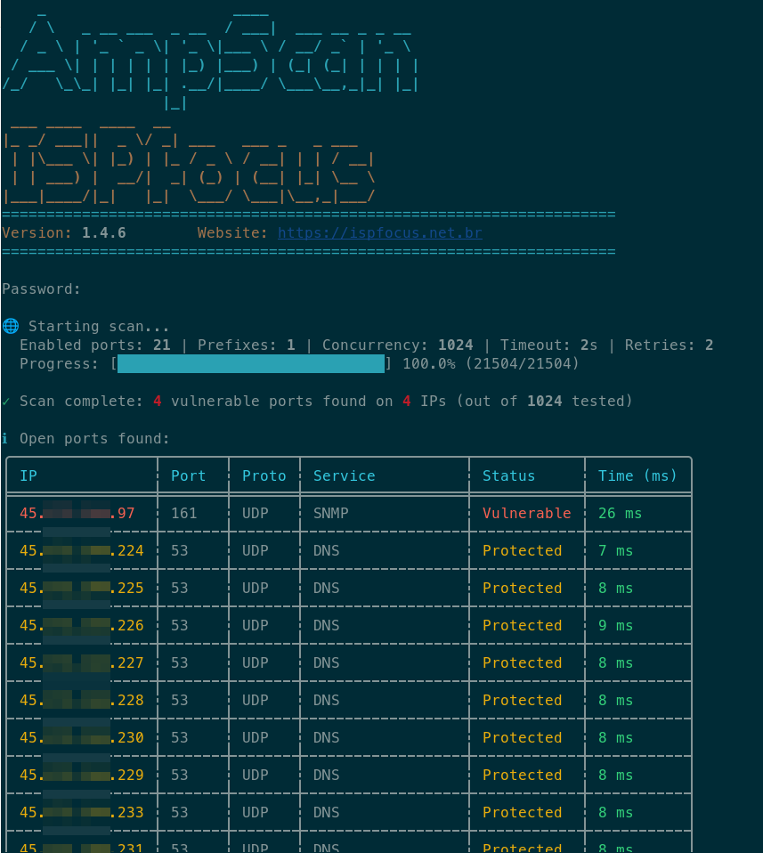

# AmpScan — Usage Manual and User Guide

**AmpScan** is a high-performance command-line (CLI) tool written in Rust, designed to audit networks and identify open and misconfigured ports that could be exploited in **DDoS amplification** attacks across IPv4 and IPv6 protocols.

---

## 🔒 Security First

AmpScan was designed with security at rest in mind. The local SQLite database (`ampscan.db`) is **completely encrypted using SQLCipher (AES-256)**.

### Crucial Environment Variables

Before running any subcommand, you must define the following variables in your environment:

*   `AMPSCAN_DB_KEY`: **[Required]** The secret key used to encrypt/decrypt the database (a long string with more than 32 characters is recommended).
*   `AMPSCAN_DB_PATH`: *(Optional)* Custom path for the database file (default: `ampscan.db`).
*   `AMPSCAN_USER`: *(Optional)* Defines the administrator user to prevent the terminal from interactively prompting for the username on each command.
*   `AMPSCAN_PASS`: *(Optional)* Defines the administrator password to prevent the terminal from interactively prompting for the password. Extremely useful for automation/cron scans.

Environment preparation example:
```bash
export AMPSCAN_DB_KEY="a_very_secure_and_long_secret_key_for_the_db"
export AMPSCAN_USER="admin"
export AMPSCAN_PASS="my_secure_admin_password"
```

---

## 🛠️ Installation and Compilation

To compile the project on your machine (requires the Rust / Cargo toolchain installed):

```bash
# Clone the repository or navigate to the folder
cd ampscan

# Compile in Release mode for maximum scanning performance
cargo build --release
```

The compiled binary will be located at `target/release/ampscan`.

---

## 🧭 Quick Start Workflow

### 1. Initialize the Database
On the first run, initialize the database to create the encrypted schema, register the 21 default ports, and configure the initial administrator user password:

```bash
ampscan init
```
*Enter the desired username and set a strong password when prompted interactively.*

### 2. Register a Network Prefix (CIDR)
For full scanning to work, you need to register which network prefixes you own/manage to be tested:

```bash
ampscan prefix add --prefix "192.168.1.0/24" --description "Corporate Office Network"
```

### 3. List Registered Ports
Check the amplification ports registered in the system:

```bash
ampscan port list
```

### 4. Launch the Interactive TUI
Launch the Terminal User Interface to monitor scans, inspect results, or run target checks interactively:

```bash
# Mandatory: --db-path must be specified to load prefixes and ports
ampscan tui --db-path /opt/ampscan/ampscan.db -c 512 -t 2
```

---

## 🖥️ Terminal User Interface (TUI) Overview

AmpScan includes a rich **Terminal User Interface (TUI)** built with `ratatui` and `crossterm`. It provides real-time visual feedback, live progress bars, finding filters, and keyboard-driven configuration.

> ⚠️ **Requirement:** The TUI requires the `--db-path` argument to be explicitly specified upon execution. The application will not load without a valid database file.

### Quick TUI Commands:

```bash
# 1. Standard TUI launch with database
ampscan tui --db-path /path/to/ampscan.db

# 2. Custom concurrency (1024 threads) and probe timeout (2s)
ampscan tui --db-path /path/to/ampscan.db -c 1024 -t 2

# 3. TUI launch with automatic PDF report generation upon scan completion
ampscan tui --db-path /path/to/ampscan.db -c 512 -t 2 --pdf --recipient "SOC Team" -o /var/reports/audit.pdf
```

---

## 📸 TUI Screens & Features

### 1. Dashboard (`[Tab]` View 1)
Displays live scan metrics, a progress bar, overall statistics (Vulnerable, Open/Protected, Closed/Filtered), active parameters, and a real-time stream of incoming probes.



*   **Key Controls:** Press `[F]` to start a Full CIDR scan, `[Space]` to pause/resume, and `[Q]` to quit.

### 2. Results Viewer (`[Tab]` View 2)
Dedicated viewer listing all detected findings (**VULNERABLE** and **Open/Protected**). Supports smooth keyboard scrolling.



*   **Key Controls:** Use `[UP]`, `[DOWN]`, `[PageUp]` (`PgUp`), and `[PageDown]` (`PgDn`) to scroll through findings.

### 3. CIDR Scan (`[Tab]` View 3)
Shows the list of network subnets (CIDR prefixes) registered in the database, along with their active status and descriptions.



### 4. Target Scan (`[Tab]` View 4)
Allows instant scanning of a single IP address (e.g., `192.168.1.1`) or specific sub-network CIDR prefix (e.g., `192.168.1.0/24`). Real-time input validation provides green/red border feedback.



*   **Key Controls:** Type the IP/CIDR target and press `[Enter]` or `[S]` to start an immediate diagnostic scan.

### 5. Port Database (`[Tab]` View 5)
Lists all 20+ DDoS amplification signatures (DNS, NTP, SNMP, Memcached, SSDP, CLDAP, etc.) registered in the system, including protocol type, probe method, and amplification factors.



### 6. Settings (`[Tab]` View 6)
Allows real-time tweaking of scanner runtime parameters: **Max Concurrency** (up to 10,000 threads), **Probe Timeout** (up to 60s), and **UDP Retries** (up to 10 attempts).



*   **Key Controls:** Use `[UP]` and `[DOWN]` setas to cycle between fields, and type digits directly to edit parameters.

---

## 📖 CLI Command Reference

### `ampscan init`
Initializes the encrypted database structure, populates it with the 21 default amplification ports, and creates the system's master user.

### Port Management (`port`)
Allows you to manage which ports and payloads will be tested during the scan:

*   **List:**
    ```bash
    ampscan --db-path ampscan.db port list
    ```
    
*   **Disable / Enable a specific port:**
    ```bash
    ampscan --db-path ampscan.db port disable <ID>
    ampscan --db-path ampscan.db port enable <ID>
    ```

### Prefix Management (`prefix`)
Defines the targets for batch scanning (accepts IPv4 and IPv6 ranges):

*   **List:**
    ```bash
    ampscan --db-path ampscan.db prefix list
    ```
    
*   **Add:**
    ```bash
    ampscan --db-path ampscan.db prefix add --prefix "2001:db8::/120" --description "IPv6 Staging Hosts"
    ```
*   **Disable / Enable:**
    ```bash
    ampscan --db-path ampscan.db prefix disable <ID>
    ampscan --db-path ampscan.db prefix enable <ID>
    ```

### User Management (`user`)
*   **Add new administrator:**
    ```bash
    ampscan --db-path ampscan.db user add --username new_admin
    ```
*   **Change password:**
    ```bash
    ampscan --db-path ampscan.db user change-password --username admin
    ```

### Running Scans (`scan`)

AmpScan has two execution modes:

#### 1. Batch Scan Mode (`scan run`)
Fetches all prefixes and ports marked as active (`enabled`) in the database and performs parallel testing directly on all hosts.

**Supported parameters:**
*   `--concurrency <N>`: Number of probes sent simultaneously (default: `256`).
*   `--timeout <S>`: Timeout for each probe's response in seconds (default: `3`).
*   `--output <PATH>`: Name of the PDF file to be generated (default: `ampscan_report.pdf`).
*   `--prefix <CIDR>`: Manual network prefix to scan (e.g.: `192.168.1.0/24`). **Ignores database-configured prefixes and skips PDF report generation**.
*   `--pdf`: Enable automatic PDF report generation.

Robust execution example:
```bash
ampscan --db-path ampscan.db scan run --concurrency 500 --timeout 2 --pdf --output scan_june.pdf
```


Example with manual prefix:
```bash
ampscan --db-path ampscan.db scan run --prefix "10.0.0.0/29"
```

#### 2. Single IP Mode (`scan single`)
Tests all active ports against a single destination IP, printing real-time responses and timings to the console:

```bash
ampscan --db-path ampscan.db scan single 1.1.1.1 --timeout 2
```

---

## 📈 Understanding the Results

During each port scan, the status can be classified as:

1.  🔴 **Open (Vulnerable):** The target responded to the sent probe. It means the amplification port is open and publicly responds to external requests without filtering.
2.  🟢 **Closed:** The host responded to at least one of the active probes, but the amplification service on this specific port yielded no response.
3.  🔵 **Inconclusive:** The tested host did not respond to any of the sent probes, suggesting the host might be offline or entirely blocking diagnostic traffic.
4.  🟡 **Protected:** The port is open, but it is not vulnerable.

---

## 🧪 Manual Verification Commands (All 21 Amplification Ports)

Below is the complete list of standard command-line instructions to manually and independently verify any finding identified by AmpScan. Replace `<IP>` with the target host address:

| Service | Port / Proto | Amplification Factor | Manual Verification Command |
|---|---|---|---|
| **QOTD** | 17 / UDP | ~140x | `echo 'test' \| nc -u -w 3 <IP> 17 \| xxd` |
| **CHARGEN** | 19 / UDP | ~358x | `echo 'test' \| nc -u -w 3 <IP> 19 \| xxd` |
| **DNS** | 53 / UDP | ~54x | `dig +short -t ANY google.com @<IP>` |
| **TFTP** | 69 / UDP | ~60x | `tftp <IP> -c get a.pdf` |
| **RPC (Portmapper)** | 111 / UDP | ~28x | `rpcinfo -T udp -p <IP>` |
| **NTP** | 123 / UDP | ~556x | `printf '\x16\x02\x00\x01\x00\x00\x00\x00\x00\x00\x00\x00' \| nc -u -w 3 <IP> 123 \| xxd` |
| **NetBIOS** | 137 / UDP | ~4x | `printf '\x00\x01\x00\x00\x00\x01\x00\x00\x00\x00\x00\x00\x20CKAAAAAAAAAAAAAAAAAAAAAAAAAAAAAA\x00\x00\x21\x00\x01' \| nc -u -w 3 <IP> 137 \| xxd` |
| **CLDAP** | 389 / UDP | ~70x | `printf '\x30\x25\x02\x01\x01\x63\x20\x04\x00\x0a\x01\x00\x0a\x01\x00\x02\x01\x00\x02\x01\x00\x01\x01\x00\x87\x0bobjectClass\x30\x00' \| nc -u -w 3 <IP> 389 \| xxd` |
| **SLP** | 427 / UDP | ~2200x | `printf '\x02\x01\x00\x00\x36\x20\x00\x00\x00\x00\x00\x01\x00\x02\x65\x6e\x00\x00\x00\x15\x73\x65\x72\x76\x69\x63\x65\x3a\x73\x65\x72\x76\x69\x63\x65\x2d\x61\x67\x65\x6e\x74\x00\x07\x64\x65\x66\x61\x75\x6c\x74\x00\x00\x00\x00' \| nc -u -w 3 <IP> 427` |
| **RIPv1** | 520 / UDP | ~30x | `printf '\x01\x01\x00\x00\x00\x00\x00\x00\x00\x00\x00\x00\x00\x00\x00\x00\x00\x00\x00\x00\x00\x00\x00\x10' \| nc -u -w 3 <IP> 520 \| xxd` |
| **SNMP** | 161 / UDP | ~6.3x | `snmpget -v 2c -c public <IP> iso.3.6.1.2.1.1.1.0` |
| **SSDP** | 1900 / UDP | ~30x | `printf 'M-SEARCH * HTTP/1.1\r\nHost:239.255.255.250:1900\r\nST:upnp:rootdevice\r\nMan:"ssdp:discover"\r\nMX:3\r\n\r\n' \| nc -u -w 3 <IP> 1900` |
| **ARMS** | 3283 / UDP | ~35.5x | `printf '\x00\x14\x00\x01\x03' \| nc -u -w 3 <IP> 3283 \| xxd` |
| **WS-DISCOVERY** | 3702 / UDP | ~153x | `printf '\x3c\xaa\x3e\x0a' \| nc -u -w 3 <IP> 3702 \| xxd` |
| **mDNS** | 5353 / UDP | ~4.7x | `dig +short -p 5353 @<IP> -t PTR _services._dns-sd._udp.local` |
| **CoAP** | 5683 / UDP | ~34x | `printf '\x40\x01\x7d\x70\xbb\x2e\x77\x65\x6c\x6c\x2d\x6b\x6e\x6f\x77\x6e\x04\x63\x6f\x72\x65' \| nc -u -w 3 <IP> 5683 \| xxd` |
| **UBNT** | 10001 / UDP | ~30x | `printf '\x01\x00\x00\x00' \| nc -u -w 3 <IP> 10001 \| xxd` |
| **Memcached** | 11211 / UDP | ~51000x | `printf '\x00\x00\x00\x00\x00\x01\x00\x00stats\n' \| nc -u -w 3 <IP> 11211` |
| **DVR-DHCPDiscover** | 37810 / UDP | ~25x | `echo -ne '\xff' \| nc -u -w 2 <IP> 37810 \| xxd` |
| **MT4145** | 4145 / TCP | Proxy / Compromised | `nc -z -v -w 3 <IP> 4145` |
| **MT5678** | 5678 / TCP | Meris Botnet | `nc -z -v -w 3 <IP> 5678` |

---

## 🚀 CI/CD & Release Automation (Codeberg)

This repository supports build and test automation via **Woodpecker CI** hosted on Codeberg:

* **Continuous Integration (CI):** On every `push` or `pull_request` sent to the `main` branch, the complete unit and integration test suite is executed automatically (with parallelism limited to `-j 1` to respect Codeberg's shared resource guidelines).
* **Continuous Delivery (CD):** When creating and pushing a version tag (e.g., `v1.4.6`), the pipeline compiles the binary (`ampscan`) in production mode (Release) for Linux x86_64, compresses it into a `.tar.gz` file, and attaches the final file directly to the Releases page on Codeberg.

